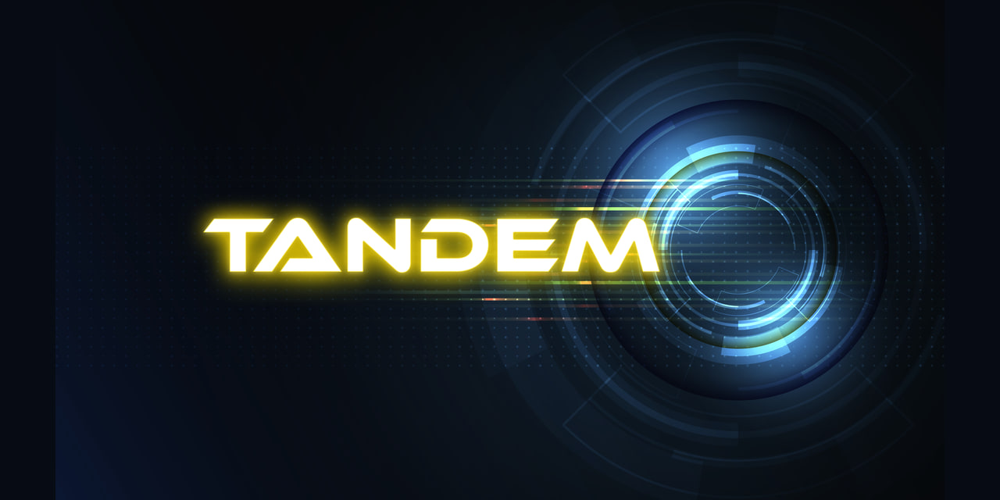
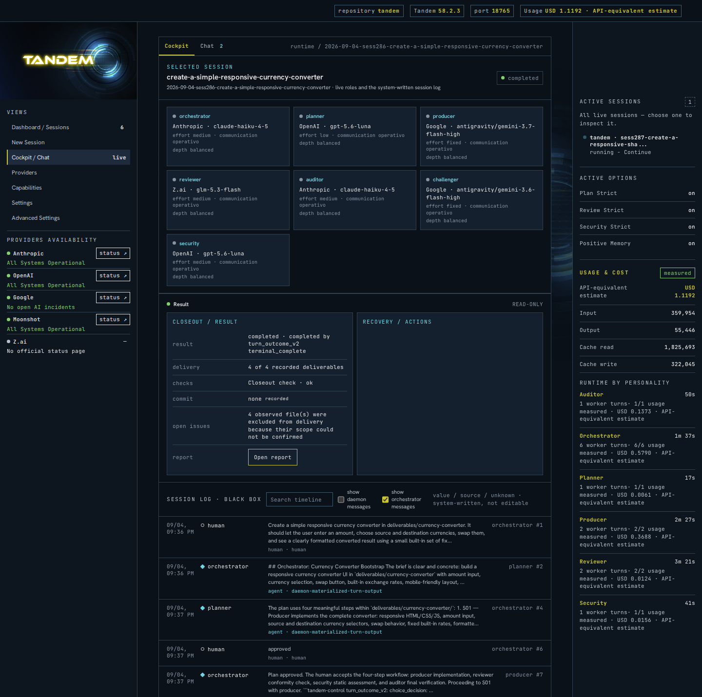

  

<h1 align="center">Tandem</h1>

<strong>Run long delegated work without babysitting it.</strong>

A single long chat drifts: context piles up, the brief blurs, and checking
the result always lands back on you. Tandem moves work forward in bounded
steps — production and review separate, decisions with you, everything on
one inspectable record. What comes back is reviewed, not just finished.

For developers and technical builders — anyone who delegates real work to
AI agents: shipping software, running analyses, building internal tools for
finance or operations.

How a session works:

- **Brief and plan.** You write the assignment; a planning role turns it
  into steps with owners, dependencies and gates. Nothing runs on a plan you
  have not approved.
- **Bounded calls.** Each step runs as a separate, short-lived call with
  only the context it needs. State, decisions and evidence live outside the
  model's context, so work can pause, fail, resume and close without losing
  its history.
- **Separate review.** The role that produces is never the role that
  judges. Review, security and audit roles check the work independently —
  and can be bound to a different model family from the one that produced
  it, so the reviewer does not share the writer's blind spots.
- **Your authority.** The session brings you the decisions that are
  actually yours — and only those — with the context you need to take them.
- **Closeout.** The session ends with a readable record: what was done,
  what was verified, what stayed open.

Tandem governs the process and makes the proof inspectable. It does not
promise that every result is correct without judgement; it makes judgement
possible.

**From a real session**

> **Brief** — Create a simple responsive currency converter: enter an
> amount, choose source and destination currencies, swap them, and see a
> clearly formatted result from a small built-in set of fixed rates. Concise
> usage instructions; comfortable on desktop and mobile.
>
> **Plan (GPT-5.6)** — Four steps. S01 Producer builds it. S02 Reviewer and
> S03 Security check it independently. S04 Auditor verifies the chain from
> claims to evidence. Nothing runs until the plan is approved.
>
> **Human, one minute after the brief** — "approved".
>
> **S01 Producer (Gemini 3.7 Flash)** — Four files, no dependencies. Ten
> currencies through a single base rate; per-currency number formatting;
> validation for empty, zero and negative amounts; a content-security policy
> that forbids any network call. Tested in a browser at desktop and phone
> sizes.
>
> **S02 Reviewer (GLM 5.3 Flash)** — Did not take the Producer's word for
> it: loaded the files in its own browser and exercised every path. 250 GBP
> to JPY showed 49,427; recomputed by hand, 49,426.75, rounded correctly.
> Swap, presets, reset, Enter key, both viewports: observed, not inferred.
> No actionable findings. Four minor observations recorded, and a list of
> what was not verified: screen-reader quality, contrast ratios, browsers
> other than Chromium.
>
> **S03 Security (GPT-5.6)** — Fresh execution: zero network requests,
> text-only DOM updates, no external code. No findings. Optional hardening
> noted and judged not material.
>
> **S04 Auditor (Claude Haiku 4.5)** — Traced the brief to the Producer's
> claims, the Reviewer's measurements and the Security checks; file hashes
> unchanged since review. Nine requirements, nine met. The gaps the
> specialists declared: bounded, on the record.
>
> **Closeout, ten minutes after the brief** — Completed. Four deliverables
> accepted. Positive Memory: patterns for the next session, validated by a
> second review. Usage measured per role: USD 1.12 at API-equivalent rates.

## Your models, your choice

Tandem works with the CLI subscriptions you already pay for — Claude Code,
Codex, Gemini CLI, Kimi and GLM — and connects directly to provider APIs
when that serves you better. You choose per role, per session: use an
API-only model like DeepSeek, reach Qwen or Grok without adding yet another
subscription, go direct to the API when your plan's allowance runs out
mid-work, or trial a model before committing to a plan. Your model mix
stays your choice; no model name lives in the core.

## The practical facts

- **Platform.** Ubuntu — native, or under WSL2 on Windows.
- **Where things run.** The session engine and the model calls run as a
  hosted service, on your own subscriptions and keys. Your repository,
  working copy and deliverables stay on your machine: a local agent applies
  each change as a typed, bounded, authorised operation and reports back.
- **Concurrency.** Several sessions at once, across several repositories,
  from one console.
- **Headless.** The same session contract runs without the console — from a
  shell, a cron job, a systemd unit or another automation — with the same
  rules for questions, pauses, evidence and closeout.
- **Record.** Session history is system-written and append-only; a local,
  exportable record of the work stays with you.
- **Install.** One `.deb` package — application, local agent and
  command-line interface — with a signed APT repository for updates.

## Private preview

Tandem is in private preview. Product pages: [jaryn.io/tandem](https://jaryn.io/tandem).
Tandem opens to a first group of design partners before the public trial:
if you run long delegated work and want it on Tandem first, write to
[tandem@jaryn.io](mailto:tandem@jaryn.io). Releases and documentation are
published here as they ship.

---

Jaryn, Tandem and AWOS names and logos are the property of Jaryn, all rights reserved. See [TRADEMARKS.md](https://github.com/jaryn-io/.github/blob/main/TRADEMARKS.md) and [NOTICE.md](https://github.com/jaryn-io/.github/blob/main/NOTICE.md).
